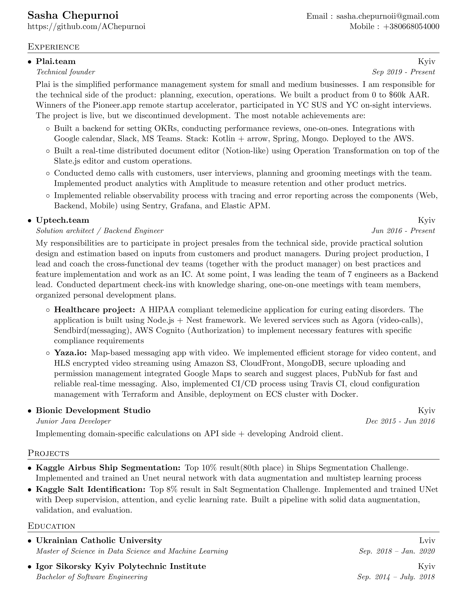

# 👨‍💻Resume 
 

This is a single page LaTeX based resume for Software Developers, built with Travis CI (free for public repos) and deployed to GitHub Releases on each change. 
The deployment includes compiled PDF and first page PDF preview.

As an example, you can check my resume [here](https://github.com/AChepurnoi/resume/releases/download/latest-build/resume.pdf) or release page [here](https://github.com/AChepurnoi/resume/releases)

## Features
* Easy to edit and build
* Easy to version
* Clear and structured
* Built with Travis CI 😱

## Quick start
### Fork
* Fork this repo
* Create a `GITHUB_API_KEY` with :repo access (Settings -> Developer settings -> Personal access tokens) 
[docs](https://docs.travis-ci.com/user/deployment/releases/#authenticating-with-an-oauth-token)
* Encrypt token  using `travis encrypt GITHUB_API_KEY={token}` and set it to secure env in `.travis.yml`
* Edit `source.tex`, commit, enjoy! You can change content or totally change the layout, it's up to you!

### Manual
* Edit `source.tex`
* Compile to pdf in ∞ ways! (`pdflatex`)

### References
* [Template base and inspiration](https://github.com/sb2nov/resume)

